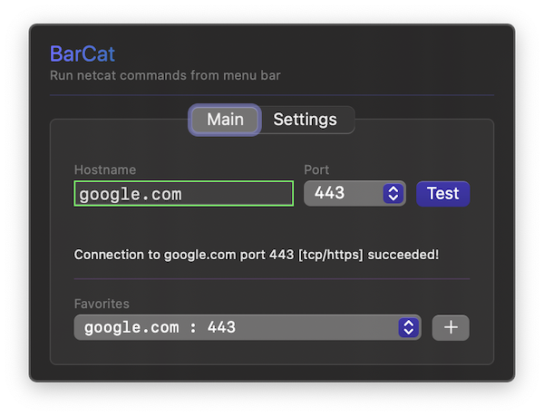

# BarCat

BarCat is a simple SwiftUI menu bar app for testing firewall ports. BarCat uses netcat (`nc`) command line utility for fw port testing.

## Requirements

- Minimum macOS version: macOS 13 Ventura
